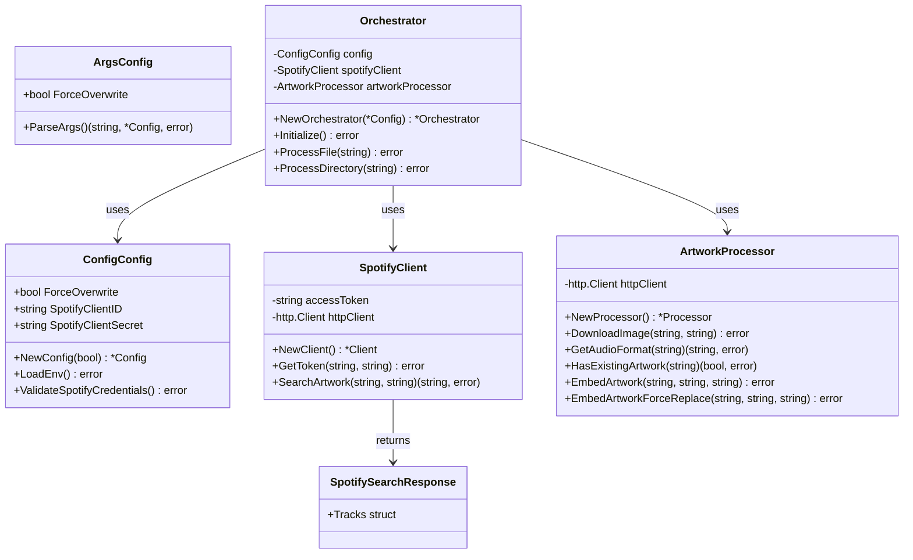
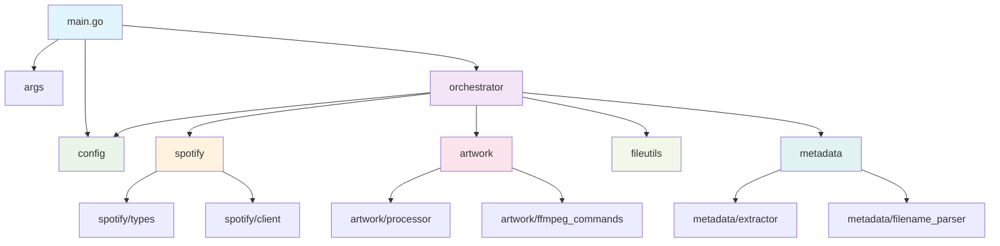

# 音楽ファイル自動アートワーク埋め込みツール

Spotify APIを使用して音楽ファイルに自動でアルバムアートワークを埋め込むGoアプリケーションです。

ffmpegコマンドはこちらを参考
https://pianoforte32.com/using-ffmpeg-to-do-meta-tag-including-artwork-in-audio-files/

## 機能

- 音楽ファイルのメタデータ（アーティスト・アルバム情報）を自動抽出
- Spotify APIを使用したアートワーク画像の自動検索
- 高品質な画像の自動ダウンロード
- ffmpegを使用したアートワークの音楽ファイルへの埋め込み
- ディレクトリ内の複数ファイルの一括処理
- メタデータ不足ファイルのスキップ機能

## 対応フォーマット

- MP3 (.mp3)
- M4A (.m4a)
- FLAC (.flac)
- WAV (.wav)

## 必要な環境

### 1. ffmpegのインストール

#### macOS
```bash
# Homebrewを使用
brew install ffmpeg
```

#### Ubuntu/Debian
```bash
sudo apt update
sudo apt install ffmpeg
```

#### CentOS/RHEL/Rocky Linux
```bash
# EPELリポジトリを有効化
sudo dnf install epel-release
sudo dnf install ffmpeg
```

#### Windows
1. [公式サイト](https://ffmpeg.org/download.html)からWindows版をダウンロード
2. 解凍してPATHに追加
3. または以下のパッケージマネージャーを使用：
```powershell
# Chocolateyを使用
choco install ffmpeg

# Scoopを使用
scoop install ffmpeg
```

#### Arch Linux
```bash
sudo pacman -S ffmpeg
```

### 2. Go言語の環境
Go 1.21以上が必要です。

### 3. Spotify API認証情報
[Spotify Developer Console](https://developer.spotify.com/dashboard/)でアプリケーションを作成し、Client IDとClient Secretを取得してください。

## セットアップ

### 1. リポジトリのクローンと依存関係のインストール
```bash
git clone <repository-url>
cd music-artwork-embedder
go mod tidy
```

### 2. Spotify API認証情報の設定
```bash
export SPOTIFY_CLIENT_ID="your_spotify_client_id"
export SPOTIFY_CLIENT_SECRET="your_spotify_client_secret"
```

Windows（PowerShell）の場合：
```powershell
$env:SPOTIFY_CLIENT_ID="your_spotify_client_id"
$env:SPOTIFY_CLIENT_SECRET="your_spotify_client_secret"
```

## 使用方法

### 単一ファイルの処理
```bash
go run main.go /path/to/music/file.mp3
```

### ディレクトリ全体の一括処理
```bash
go run main.go /path/to/music/directory
```

### 実行可能ファイルとしてビルド
```bash
go build -o music-artwork-embedder
./music-artwork-embedder /path/to/music/file.mp3
```

## Spotify Developer Console設定手順

1. [Spotify Developer Console](https://developer.spotify.com/dashboard/)にアクセス
2. Spotifyアカウントでログイン
3. 「Create App」をクリック
4. アプリ情報を入力：
    - App name: 任意の名前
    - App description: 任意の説明
    - Redirect URI: `http://localhost` (使用しませんが必須)
    - API/SDKs: Web API にチェック
5. 作成後、「Settings」から Client ID と Client Secret を取得
## アーキテクチャ

### 概要

このプロジェクトは、単一責任の原則に基づいてパッケージ分割されたモジュラー設計を採用しています。各パッケージは明確に定義された責務を持ち、疎結合で高凝集な構造となっています。

- **責務分離**: 各パッケージが特定の機能領域に特化
- **依存性注入**: `orchestrator`パッケージが各コンポーネントを協調
- **エラーハンドリング**: 堅牢なエラー処理とバックアップ機能
- **拡張性**: 新しい音声フォーマットやAPIの追加が容易

### ディレクトリ構造

```
.
├── .env.local                    # 環境変数設定ファイル
├── .gitignore                    # Git除外設定
├── go.mod                        # Go モジュール定義
├── go.sum                        # 依存関係チェックサム
├── go_build.sh                   # ビルドスクリプト
├── main.go                       # アプリケーションエントリーポイント
├── README.md                     # プロジェクト説明書
└── src/                          # ソースコードディレクトリ
    ├── args/                     # コマンドライン引数処理
    │   └── args.go
    ├── artwork/                  # アートワーク処理
    │   ├── ffmpeg_commands.go    # ffmpegコマンド実行
    │   └── processor.go          # アートワーク処理ロジック
    ├── config/                   # 設定管理
    │   └── config.go
    ├── fileutils/                # ファイル操作ユーティリティ
    │   └── fileutils.go
    ├── metadata/                 # メタデータ処理
    │   ├── extractor.go          # メタデータ抽出
    │   └── filename_parser.go    # ファイル名解析
    ├── orchestrator/             # 処理統合・制御
    │   └── orchestrator.go
    └── spotify/                  # Spotify API連携
        ├── client.go             # APIクライアント
        └── types.go              # データ型定義
```

### パッケージ詳細

#### `args` - コマンドライン引数処理
- **責務**: コマンドライン引数の解析と設定管理
- **主要構造体**: `Config`
- **主要関数**: `ParseArgs()`

#### `config` - 設定管理
- **責務**: アプリケーション設定と環境変数の管理
- **主要構造体**: `Config`
- **主要関数**: `NewConfig()`, `LoadEnv()`, `ValidateSpotifyCredentials()`

#### `spotify` - Spotify API連携
- **責務**: Spotify Web APIとの通信とアートワーク検索
- **主要構造体**: `Client`, `SpotifySearchResponse`
- **主要関数**: `NewClient()`, `GetToken()`, `SearchArtwork()`

#### `metadata` - メタデータ処理
- **責務**: 音楽ファイルのメタデータ抽出とファイル名解析
- **主要関数**: `ExtractMetadata()`, `ExtractTitleFromFilename()`

#### `artwork` - アートワーク処理
- **責務**: 画像ダウンロード、フォーマット検出、ffmpegによる埋め込み
- **主要構造体**: `Processor`
- **主要関数**: `NewProcessor()`, `DownloadImage()`, `EmbedArtwork()`, `EmbedArtworkForceReplace()`

#### `fileutils` - ファイル操作ユーティリティ
- **責務**: ファイルのバックアップ、復元、検証、ディレクトリ処理
- **主要関数**: `CreateBackup()`, `RestoreFromBackup()`, `ValidateAudioFile()`, `ProcessDirectory()`

#### `orchestrator` - 処理統合・制御
- **責務**: 各パッケージの協調と全体的な処理フローの制御
- **主要構造体**: `Orchestrator`
- **主要関数**: `NewOrchestrator()`, `Initialize()`, `ProcessFile()`, `ProcessDirectory()`

### クラス図（構造体関係）



### パッケージ依存関係図



## 動作の流れ

### 全体的な処理フロー

1. **初期化**: `main.go`でコマンドライン引数を解析し、設定を読み込み
2. **オーケストレーター作成**: 各パッケージのインスタンスを生成・注入
3. **Spotify認証**: API認証トークンを取得
4. **ファイル処理**: 指定されたファイル/ディレクトリを処理

### 単一ファイル処理の詳細フロー

1. **バックアップ作成**: `fileutils`パッケージで元ファイルをバックアップ
2. **既存アートワーク確認**: `artwork`パッケージで既存アートワークの有無を確認
3. **メタデータ抽出**: `metadata`パッケージでアーティスト・アルバム・タイトル情報を抽出
4. **フォールバック処理**: メタデータ不足時にファイル名から情報を抽出
5. **アートワーク検索**: `spotify`パッケージでSpotify APIを使用して画像を検索
6. **画像ダウンロード**: `artwork`パッケージで最高品質の画像をダウンロード
7. **アートワーク埋め込み**: `artwork`パッケージでffmpegを使用して画像を埋め込み
8. **ファイル検証**: `fileutils`パッケージで出力ファイルの整合性を確認
9. **ファイル置換**: 元ファイルを処理済みファイルで置換
10. **クリーンアップ**: バックアップファイルと一時ファイルを削除

### パッケージ間の協調

- **`orchestrator`**: 全体の処理フローを制御し、各パッケージを適切な順序で呼び出し
- **エラー処理**: 各段階でエラーが発生した場合、`fileutils`パッケージでバックアップから復元
- **設定管理**: `config`パッケージで環境変数と実行時オプションを一元管理

## エラーハンドリング

### スキップされるファイル
- メタデータ（アーティスト・アルバム情報）が不足している音楽ファイル
- Spotify APIでアートワークが見つからない音楽ファイル
- 対応していないファイル形式

### 警告メッセージ
```
警告: アーティストまたはアルバム情報が不足しています。スキップします。
警告: アートワーク検索に失敗しました (アートワークが見つかりませんでした)。スキップします。
```

## 注意事項

- **ファイルの上書き**: 処理により元のファイルが上書きされます。事前にバックアップを取ることを推奨します
- **API制限**: Spotify APIには使用制限があります。大量のファイルを処理する際は注意してください
- **メタデータ要件**: アーティスト名またはアルバム名のいずれかが必要です
- **ネットワーク**: インターネット接続が必要です

## トラブルシューティング

### ffmpegが見つからない
```
エラー: ffmpegがインストールされていません
```
→ 上記のffmpegインストール手順を参照してください

### Spotify認証エラー
```
Spotify認証エラー: ...
```
→ SPOTIFY_CLIENT_IDとSPOTIFY_CLIENT_SECRETが正しく設定されているか確認してください

### メタデータが読み取れない
```
メタデータを読み取れませんでした: ...
```
→ ファイルが破損しているか、対応していない形式の可能性があります

## ライセンス

このプロジェクトはMITライセンスの下で公開されています。

## 依存関係

### 外部ライブラリ

- [github.com/dhowden/tag](https://github.com/dhowden/tag) - 音楽ファイルメタデータ読み取り
- [github.com/joho/godotenv](https://github.com/joho/godotenv) - 環境変数ファイル読み込み
- Go標準ライブラリ
- ffmpeg（外部依存）

### 内部パッケージ依存関係

内部パッケージ間の依存関係については、上記の「[パッケージ依存関係図](#パッケージ依存関係図)」を参照してください。